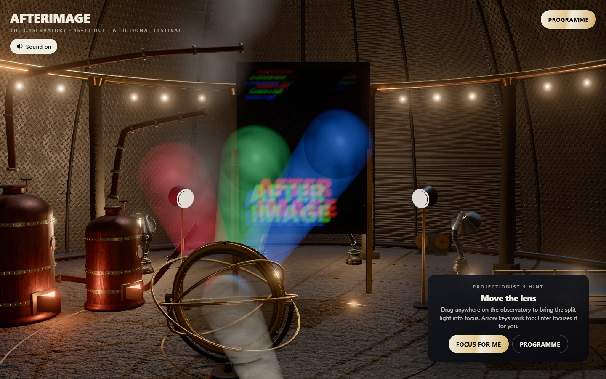
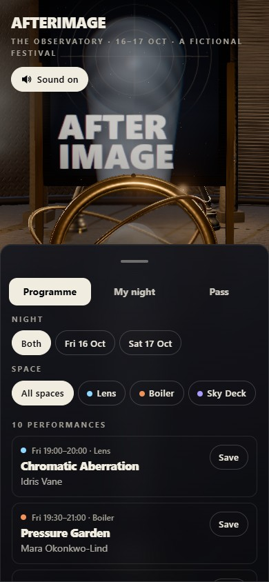
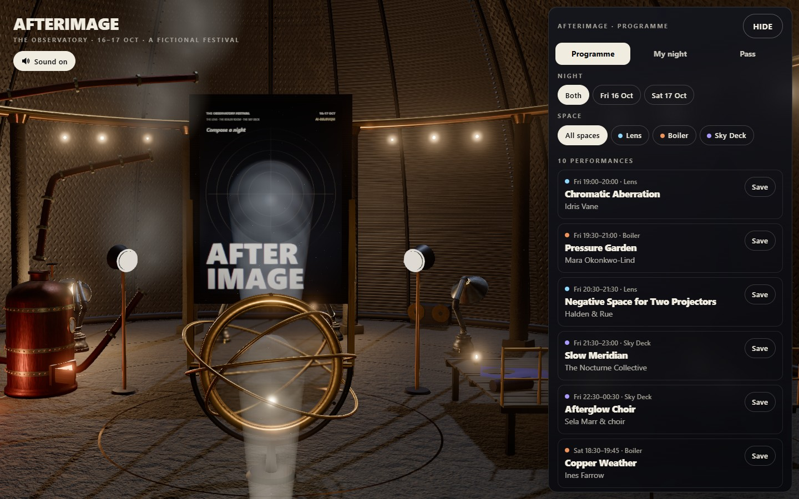

# AFTERIMAGE

<p align="center"></p>

Focus a projection lens inside a disused observatory, compose a night at a fictional light-and-sound festival and leave with a poster made from the performances you chose. The lens, venues, itinerary, poster and demo pass are parts of one continuous experience.

**[Compose your night →](https://03-afterimage.williamking.workers.dev)** · [Run locally](#run-locally) · [Credits](#credits)

<p align="center"></p>

## From first light to a finished night

1. **Focus the lens.** Drag across the observatory or use the arrow keys; hold Shift for finer steps. Split red, green and blue light converges as you find focus. Enter or **Focus for me** completes the opening for you.
2. **Explore ten performances.** Filter two nights and three spaces, read a performance's details and save it to your night.
3. **Visit the stages.** Optical rings align in The Lens, ribbons and fireboxes animate the Boiler Room, and the Sky Deck opens toward the stars. Your saved performances are represented in the venue scene.
4. **Resolve clashes.** My night detects overlaps, including performances that cross midnight, and lets you choose which one to keep.
5. **Take a poster and pass.** Each saved performance adds its own visual motif. Issue a clearly labelled demo ticket, download the poster as PNG or copy a link that restores the itinerary.

An optional three-board mirror-and-shutter puzzle lights a sculpture and earns a foil stamp. It does not gate the programme or pass. Sound starts after interaction; use **M** or the Sound button to mute. Reduced motion provides a calmer route through the same content.

## How it is built

- **A shared optical state** drives lens offset, additive beams, the RGB-separated screen and focus feedback. The observatory, dome hardware and venue scenery are built procedurally.
- **One deterministic poster composition** feeds the in-world projection, pass preview and downloadable image. Saved selections also determine the poster's mood line and serial.
- **Pure scheduling rules** handle overlaps, pass coverage and the URL share codec independently of the renderer.
- **GSAP scene choreography** coordinates cameras, venue transformations, lighting and typography. Web Audio follows focus and UI state, including quieter mixes under dialogs.
- **Adaptive rendering** selects a starting tier, caps pixel cost and reduces expensive effects when frames run long. Shader warm-up and finite-colour protection precede the visible scene.

## Project map and verification

[src/game/](src/game/) contains the schedule, puzzle and poster rules; [src/scene/](src/scene/) draws the observatory; [src/ui/](src/ui/) contains the programme, HUD and poster renderer; [src/audio/](src/audio/) owns sound.

The recorded release includes 30 unit tests and a browser journey through focus, saved performances, clash resolution and pass issuance. The current performance revision is `fd7772a`. The default Playwright configuration uses reduced motion and software WebGL for repeatability; real-GPU release checks are separate. Artists, events, prices and tickets are fictional; there is no purchase or booking backend.

## Current screenshots

| Desktop | Phone |
| --- | --- |
|  |  |



The opening loop and three main screenshots were captured from the live site on **1 October 2026**, using Chrome on this workstation; the phone image is a 390 × 844 browser viewport. The animated preview is a short loop, not a full playthrough. [Capture details](docs/readme/capture.json).

## Run locally

Use **Bun 1.3.10** (the version pinned in `package.json`) and Node.js 22.12 or newer. From this repository:

```sh
bun install --frozen-lockfile
bun run dev      # http://127.0.0.1:4513/
bun run check    # strict types, Biome, unit tests and production build
bun run preview  # http://127.0.0.1:4613/ after the build
```

Development and preview are separate long-running commands; run one at a time or use separate terminals. `bun run build` writes the static production output to `dist/`. Dependencies and the lockfile are local to this project.

### Browser suite

Install the test browser once, then run the checked-in Playwright suite. Its configuration builds and starts the production preview. Browser scenarios are separate from `bun run check`.

```sh
bunx playwright install chromium
bun run e2e
```

The recorded real-GPU release checks used installed Chrome on an RTX 2060; the default Chromium configuration is not a claim of physical-phone coverage.

## Stack and release

Direct Three.js 0.186 · React 19.3 · strict TypeScript · Vite 8.3 · GSAP 3.15 · Tailwind CSS 4.3 · Bun 1.3.10 · Biome. The public website is served by Cloudflare Workers. This README describes [application revision fd7772a](https://github.com/WilliamHenryKing/03-afterimage/commit/fd7772affa4f7e8ed8c7524ce78a79c334947bdf); the documentation refresh changes no application behaviour.

## Credits

All geometry, shaders, poster motifs and typography are authored procedurally in this repository and set in the system font stack. There are no external images, models or fonts.

### Audio

Every audio file is CC0 (public domain dedication, [CC0 licence](https://creativecommons.org/publicdomain/zero/1.0/)). No attribution is required, but it is given here. Files were loudness-normalised and transcoded to MP3 (SFX mono) in `public/audio/`, about 1.9 MB in total.

| File | Original | Author | Source | Licence |
| --- | --- | --- | --- | --- |
| `music.mp3` | First Light Particles | Yoiyami | [Source](https://opengameart.org/content/first-light-particles-%E2%80%93-cc0-atmospheric-pianoambient-track) | CC0 |
| `ambience.mp3` | Deep Space Array (`Spacearray_0.ogg`) | Tozan | [Source](https://opengameart.org/content/deep-space-array) | CC0 |
| `lens-hum.mp3` | `spaceEngineLow_001.ogg` (Sci-Fi Sounds) | Kenney | [Source](https://kenney.nl/assets/sci-fi-sounds) | CC0 |
| `venue.mp3` | `doorOpen_001.ogg` (Sci-Fi Sounds) | Kenney | [Source](https://kenney.nl/assets/sci-fi-sounds) | CC0 |
| `focus.mp3` | `impactBell_heavy_000.ogg` (Impact Sounds) | Kenney | [Source](https://kenney.nl/assets/impact-sounds) | CC0 |
| `shutter.mp3` | `impactMetal_light_000.ogg` (Impact Sounds) | Kenney | [Source](https://kenney.nl/assets/impact-sounds) | CC0 |
| `save.mp3` | `confirmation_001.ogg` (Interface Sounds) | Kenney | [Source](https://kenney.nl/assets/interface-sounds) | CC0 |
| `unsave.mp3` | `back_001.ogg` (Interface Sounds) | Kenney | [Source](https://kenney.nl/assets/interface-sounds) | CC0 |
| `clash.mp3` | `question_001.ogg` (Interface Sounds) | Kenney | [Source](https://kenney.nl/assets/interface-sounds) | CC0 |
| `keep.mp3` | `select_003.ogg` (Interface Sounds) | Kenney | [Source](https://kenney.nl/assets/interface-sounds) | CC0 |
| `click.mp3` | `click_002.ogg` (Interface Sounds) | Kenney | [Source](https://kenney.nl/assets/interface-sounds) | CC0 |
| `tick.mp3` | `tick_002.ogg` (Interface Sounds) | Kenney | [Source](https://kenney.nl/assets/interface-sounds) | CC0 |
| `panel-open.mp3` | `maximize_003.ogg` (Interface Sounds) | Kenney | [Source](https://kenney.nl/assets/interface-sounds) | CC0 |
| `panel-close.mp3` | `minimize_003.ogg` (Interface Sounds) | Kenney | [Source](https://kenney.nl/assets/interface-sounds) | CC0 |
| `mirror.mp3` | `switch_002.ogg` (Interface Sounds) | Kenney | [Source](https://kenney.nl/assets/interface-sounds) | CC0 |
| `beam-lit.mp3` | `glass_005.ogg` (Interface Sounds) | Kenney | [Source](https://kenney.nl/assets/interface-sounds) | CC0 |
| `copy.mp3` | `drop_002.ogg` (Interface Sounds) | Kenney | [Source](https://kenney.nl/assets/interface-sounds) | CC0 |
| `replay.mp3` | `open_001.ogg` (Interface Sounds) | Kenney | [Source](https://kenney.nl/assets/interface-sounds) | CC0 |
| `ticket.mp3` | `jingles_STEEL07.ogg` (Music Jingles) | Kenney | [Source](https://kenney.nl/assets/music-jingles) | CC0 |
| `puzzle-done.mp3` | `jingles_PIZZI00.ogg` (Music Jingles) | Kenney | [Source](https://kenney.nl/assets/music-jingles) | CC0 |

The environment reflections use three.js's built-in `RoomEnvironment` (MIT, part of three.js). All artists, performances and prices are fictional.

---

Part of [William King's portfolio collection](https://github.com/WilliamHenryKing).
