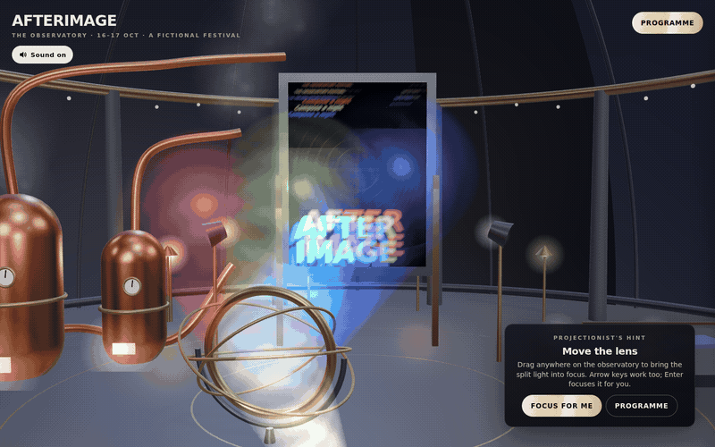
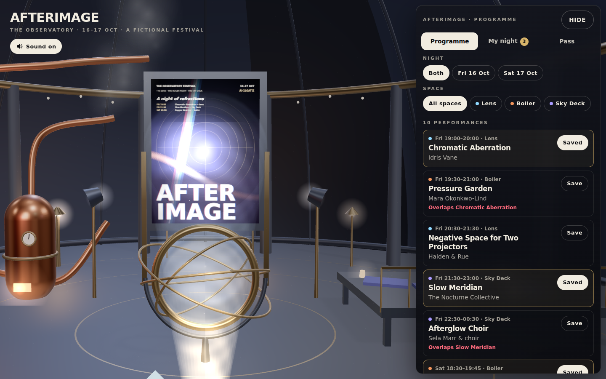
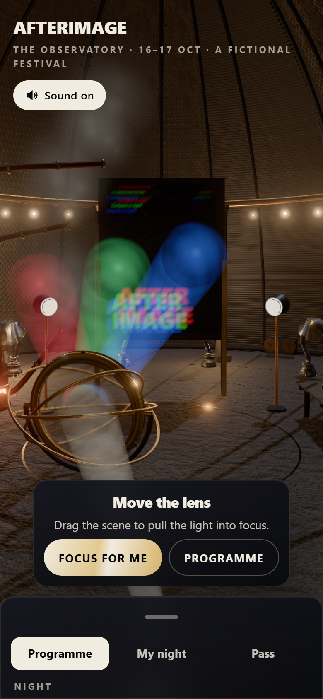

<p align="center">
  
</p>

<p align="center">
  <a href="https://03-afterimage.williamking.workers.dev"></a>
  
  
  
  
  
  
  
  
</p>

<p align="center"><strong>Focus a giant projection lens in a decommissioned observatory, compose your night at a fictional light-and-sound festival, and leave with a poster made from the performances you chose.</strong></p>

<p align="center">
  
</p>

## What you can do

- **Focus the lens.** Drag anywhere on the observatory, or use the arrow keys (Shift for fine steps). Out of focus, the light splits into red, green and blue beams that spill across the dome. Bring it to the centre and the beams converge in a bloom, a chord resolves and the identity snaps crisp. **Enter** or **Focus for me** does it for you.
- **Browse the programme.** Ten performances over two nights in three spaces, with night and space filters, readable details and a direct link for each.
- **Visit the spaces.** Each has its own stage transformation. In **The Lens**, optical rings swing into alignment under floodlights. In the **Boiler Room**, foil ribbons unfurl over glowing fireboxes, gauges and steam. On the **Sky Deck**, the deck rises, lanterns glow and the dome shutter opens to stars and meteors. Your saved performances glow where they happen.
- **Compose your night.** Every saved performance lays its own motif onto your poster: a slit of light, a foil ribbon, a patterned projection or a field of soft colour. The poster is projected live on the observatory screen as you choose.
- **Resolve clashes.** **My night** detects real overlaps and lets you keep one side in a single tap.
- **Take your pass.** The pass that fits your night is preselected. Issue a clearly labelled demo ticket, download the poster as a PNG, or copy a link that restores the night.
- **Optional puzzle.** Turn mirrors and open shutters on three small boards to light a sculpture and earn a foil stamp. Nothing is locked behind it.

Sound (CC0 music, ambience and cues) starts on your first interaction. **M** or the **Sound** button mutes it. The experience works fully in silence and honours `prefers-reduced-motion`.

## What's inside

- **One continuous three.js scene.** A procedurally built observatory with dome ribs, a gallery ring, brass lamps, a projector and a draggable glass lens. It uses AgX tone mapping, a moonlight key, a rim light from the dome and soft shadows.
- **Split-beam optics.** The lens offset drives three additive light cones and a screen shader that separates the poster's red, green and blue channels. Dust in the throw lights up only inside the beams.
- **A generated poster.** A pure, tested composition function turns the saved itinerary into layered motifs, a mood line and a serial. One canvas renderer feeds the projection screen, the pass preview and the PNG export.
- **Real scheduling rules.** Overlap detection (including sets past midnight), keep-one-side clash resolution, pass coverage and a URL-hash share codec, all in pure TypeScript with unit tests.
- **Staged venues.** GSAP timelines move camera, light and scenery together, and oversized venue typography sweeps across in step.
- **Designed sound.** A Web Audio engine unlocked on first gesture, with a lens hum that follows motion and focus, music that enters on the reveal, ducking under dialogs and a resolving chord synthesised live.
- **Tested end to end.** 30 unit tests and a Playwright journey: focus, save, resolve a clash, issue the pass.

## Screens

<table>
  <tr>
    <td width="72%"></td>
    <td width="28%"></td>
  </tr>
  <tr>
    <td align="center">Desktop, 1440 × 900</td>
    <td align="center">Phone, 390 × 844</td>
  </tr>
</table>

## Built with

**three.js 0.186** (direct, no React Three Fiber), **React 19**, **strict TypeScript**, **Vite 8**, **GSAP 3**, **Tailwind CSS 4**, **Biome**, **Bun**, the **Web Audio API** and **Playwright**.

Notable techniques:

- **The split-beam lens.** A single lens offset feeds the beam geometry, the landing splashes and a screen shader. Out of focus it pulls the poster's colour channels apart; on focus they converge, with a bloom and an exposure punch.
- **The itinerary poster.** A deterministic, order-independent composition from the saved night, drawn once to a 2D canvas and reused as a WebGL texture, UI preview and export.
- **Beam-aware haze.** A GPU point field lit by its distance to the projector→lens and lens→screen segments, so the light reads as shafts without post-processing.

## Run it locally

```sh
bun install
bun run dev     # http://127.0.0.1:4513/
bun run check   # strict tsc, Biome, bun test, production build into dist/
bun run e2e     # optional: Playwright journey in headless Chromium (bunx playwright install chromium once)
```

Code map: `src/game/` holds the pure rules (tested), `src/scene/` the three.js scene, `src/ui/` the React HUD and poster renderer, `src/audio/` the sound engine, and `src/main.tsx` the wiring.

## Credits

All geometry, shaders, poster motifs and typography are authored procedurally in this repository and set in the system font stack. There are no external images, models or fonts.

### Audio

Every audio file is CC0 (public domain dedication, https://creativecommons.org/publicdomain/zero/1.0/). No attribution is required, but it is given here. Files were loudness-normalised and transcoded to MP3 (SFX mono) in `public/audio/`, about 1.9 MB in total.

| File | Original | Author | Source | Licence |
| --- | --- | --- | --- | --- |
| `music.mp3` | First Light Particles | Yoiyami | https://opengameart.org/content/first-light-particles-%E2%80%93-cc0-atmospheric-pianoambient-track | CC0 |
| `ambience.mp3` | Deep Space Array (`Spacearray_0.ogg`) | Tozan | https://opengameart.org/content/deep-space-array | CC0 |
| `lens-hum.mp3` | `spaceEngineLow_001.ogg` (Sci-Fi Sounds) | Kenney | https://kenney.nl/assets/sci-fi-sounds | CC0 |
| `venue.mp3` | `doorOpen_001.ogg` (Sci-Fi Sounds) | Kenney | https://kenney.nl/assets/sci-fi-sounds | CC0 |
| `focus.mp3` | `impactBell_heavy_000.ogg` (Impact Sounds) | Kenney | https://kenney.nl/assets/impact-sounds | CC0 |
| `shutter.mp3` | `impactMetal_light_000.ogg` (Impact Sounds) | Kenney | https://kenney.nl/assets/impact-sounds | CC0 |
| `save.mp3` | `confirmation_001.ogg` (Interface Sounds) | Kenney | https://kenney.nl/assets/interface-sounds | CC0 |
| `unsave.mp3` | `back_001.ogg` (Interface Sounds) | Kenney | https://kenney.nl/assets/interface-sounds | CC0 |
| `clash.mp3` | `question_001.ogg` (Interface Sounds) | Kenney | https://kenney.nl/assets/interface-sounds | CC0 |
| `keep.mp3` | `select_003.ogg` (Interface Sounds) | Kenney | https://kenney.nl/assets/interface-sounds | CC0 |
| `click.mp3` | `click_002.ogg` (Interface Sounds) | Kenney | https://kenney.nl/assets/interface-sounds | CC0 |
| `tick.mp3` | `tick_002.ogg` (Interface Sounds) | Kenney | https://kenney.nl/assets/interface-sounds | CC0 |
| `panel-open.mp3` | `maximize_003.ogg` (Interface Sounds) | Kenney | https://kenney.nl/assets/interface-sounds | CC0 |
| `panel-close.mp3` | `minimize_003.ogg` (Interface Sounds) | Kenney | https://kenney.nl/assets/interface-sounds | CC0 |
| `mirror.mp3` | `switch_002.ogg` (Interface Sounds) | Kenney | https://kenney.nl/assets/interface-sounds | CC0 |
| `beam-lit.mp3` | `glass_005.ogg` (Interface Sounds) | Kenney | https://kenney.nl/assets/interface-sounds | CC0 |
| `copy.mp3` | `drop_002.ogg` (Interface Sounds) | Kenney | https://kenney.nl/assets/interface-sounds | CC0 |
| `replay.mp3` | `open_001.ogg` (Interface Sounds) | Kenney | https://kenney.nl/assets/interface-sounds | CC0 |
| `ticket.mp3` | `jingles_STEEL07.ogg` (Music Jingles) | Kenney | https://kenney.nl/assets/music-jingles | CC0 |
| `puzzle-done.mp3` | `jingles_PIZZI00.ogg` (Music Jingles) | Kenney | https://kenney.nl/assets/music-jingles | CC0 |

The environment reflections use three.js's built-in `RoomEnvironment` (MIT, part of three.js). All artists, performances and prices are fictional.

---

<p align="center"><sub>Part of William King's portfolio collection.</sub></p>
